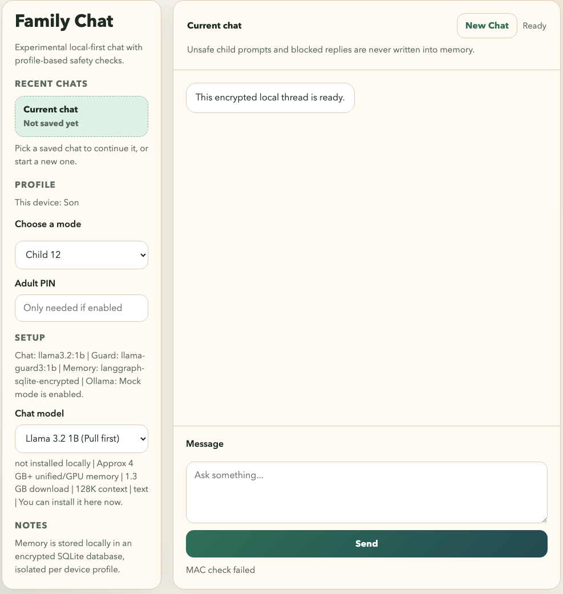

# Family Chat Experiment


This is an experimental local-first setup exploring safer family-friendly chat patterns.

It combines a lightweight browser UI, local Ollama models, profile-based prompt and response filtering, and encrypted local conversation memory. This repo is not a certified child-safety product, not a guarantee, and not ready to market as a parental safety solution. It is a first step toward that goal, meant for local experiments, and open to contributions from people who want to test ideas, improve guardrails, or stress-test the current approach.



## Table of Contents

- [What exists today](#what-exists-today)
- [5-minute quickstart](#5-minute-quickstart)
- [Windows quick use](#windows-quick-use)
- [Defaults](#defaults)
- [Architecture](#architecture)
- [Local config notes](#local-config-notes)
- [Known limits / what's missing](#known-limits--whats-missing)
- [Good first contributions](#good-first-contributions)
- [Contributing](#contributing)
- [License](#license)
- [Windows note](#windows-note)

## What exists today

- local web UI served by a small Python server
- local Ollama-backed chat model
- moderation pass on both the user prompt and the assistant reply
- a stricter `child-12` profile with age-appropriate prompting and extra keyword screening
- encrypted LangGraph short-term memory stored in local SQLite
- separate persisted threads for each device profile and conversation
- a chat model selector across Llama-family options with rough local memory guidance

## 5-minute quickstart

### 1. Install prerequisites

- `uv`
- Ollama

### 2. Install the project and create local config

```bash
uv sync
cp .env.example .env
```

Then edit `.env` and set a real local key:

```bash
LANGGRAPH_AES_KEY=0123456789abcdef0123456789abcdef
```

### 3. Fastest way to try it: mock mode

If you want to see the UI and safety flow without pulling models first:

```bash
export FAMILY_CHAT_MOCK_OLLAMA=1
.venv/bin/python -m family_chat.server
```

Open [http://127.0.0.1:8080](http://127.0.0.1:8080).

### 4. Full local model setup

Start Ollama in one terminal:

```bash
ollama serve
```

Pull the default models in another terminal:

```bash
ollama pull llama3.2:1b
ollama pull llama-guard3:1b
```

Then run the app:

```bash
.venv/bin/python -m family_chat.server
```

Open [http://127.0.0.1:8080](http://127.0.0.1:8080).

### 5. Run tests

```bash
.venv/bin/python -m unittest discover -s tests -v
```

## Windows quick use

If you clone this repo onto a Windows PC and want a child-friendly daily flow, use the included launchers:

1. Install `uv` and Ollama for Windows.
2. Clone the repo.
3. Double-click [Setup Family Chat.cmd](./Setup%20Family%20Chat.cmd) once.
4. After setup, the child can just double-click [Open Family Chat.cmd](./Open%20Family%20Chat.cmd).

What the setup script does:

- creates `.env` from `.env.example` if needed
- generates a local `LANGGRAPH_AES_KEY` if the env file still has a placeholder
- runs `uv sync`
- starts Ollama if it is not already running
- pulls the configured chat and guard models from `.env`

What the open script does:

- starts Ollama in the background if needed
- starts the Family Chat Python server in the background if needed
- opens the browser to the local app

If you want it to start automatically after Windows login, run [Enable Family Chat Auto Start.cmd](./Enable%20Family%20Chat%20Auto%20Start.cmd) once. That installs a per-user Startup launcher so nobody needs to manually run `ollama serve` or `python -m family_chat.server`.

The Windows scripts live in [scripts/windows](./scripts/windows).

## Defaults

- The server binds to `127.0.0.1` by default.
- The sample env keeps the setup local and leaves LAN exposure as an explicit opt-in.
- The `adult` profile stays disabled until `FAMILY_CHAT_ADMIN_PIN` is set.
- Model-pull PIN protection only turns on when both `FAMILY_CHAT_ADMIN_PIN` and `FAMILY_CHAT_MODEL_PULL_REQUIRES_PIN=1` are set.

## Architecture

The browser never talks directly to Ollama.

`Browser -> Family Chat server -> safety gate -> LangGraph memory lookup -> chat model -> safety gate -> LangGraph memory save`

Why that matters:

- the child profile cannot bypass moderation from the UI alone
- age-based policy lives outside the base model
- blocked child prompts and blocked replies are never written into memory
- each install keeps its own isolated local memory
- you can swap in a larger chat model later without changing the safety flow

## Local config notes

The sample `.env.example` covers the main local knobs:

- `LANGGRAPH_AES_KEY` must be exactly 16, 24, or 32 bytes long
- `FAMILY_CHAT_DEVICE_MEMBER` fixes the identity for this install
- `FAMILY_CHAT_ADMIN_PIN` enables the `adult` profile
- `FAMILY_CHAT_MODEL_PULL_REQUIRES_PIN=1` makes model pulls use that same adult PIN

Privacy note:

- SQLite memory contents are encrypted
- copying only the database file should not expose chat contents
- copying both the database and the local `.env` file can still expose the contents
- OS-level secure secret storage is still future work

## Known limits / what's missing

- The guardrails are still basic. They combine prompting, a guard model, and manual keyword rules, but they have not been deeply red-teamed yet.
- The admin PIN is intentionally lightweight. It is a convenience control, not a tamper-proof parental control system.
- The local setup is still technical. It is better suited to makers and developers than to average parents today.
- Child safety coverage is incomplete. This should not be presented as a comprehensive or certified protection layer.
- High-risk topics still need more nuanced handling and better refusal flows.
- The current evaluation story is thin. More adversarial tests, multilingual cases, and edge-case safety checks are needed.

## Good first contributions

- add stronger safety and jailbreak tests
- add more age profiles and safer refusal patterns
- improve admin gating and parent-only controls
- package a smoother Windows install path
- tighten the UI copy and setup guidance
- improve documentation around threat model and limitations

## Contributing

Ideas, issues, and pull requests are welcome. If you want to help, start with [CONTRIBUTING.md](CONTRIBUTING.md).
Recent project history is tracked in [CHANGELOG.md](CHANGELOG.md).

## License

This project is available under the [MIT License](LICENSE).

## Windows note

This started as a macOS-first experiment, but the longer-term target is a Windows-friendly setup for local home use. If you want to help with packaging, startup scripts, or installer ergonomics, that is a high-value contribution area.
